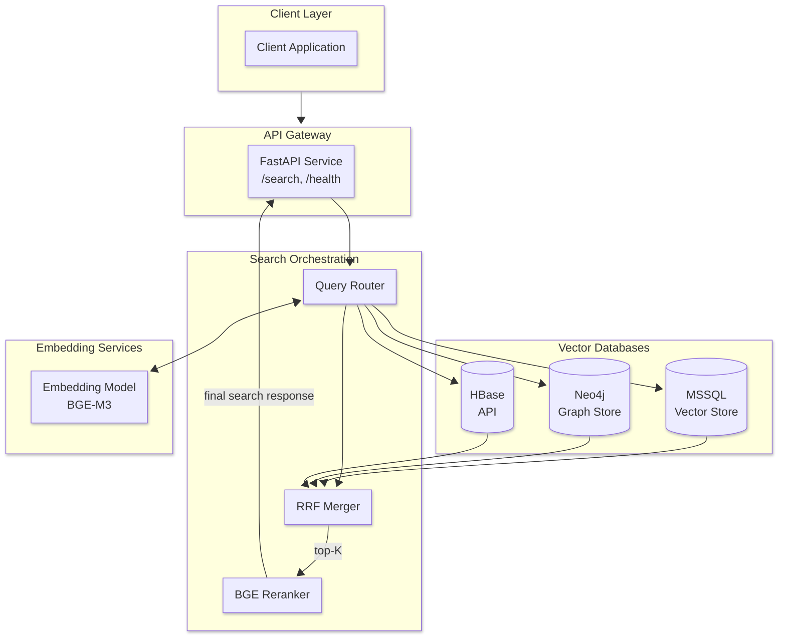
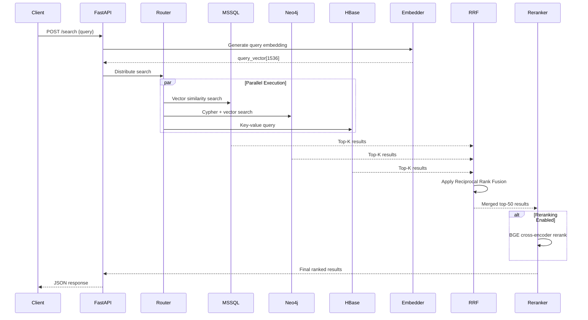
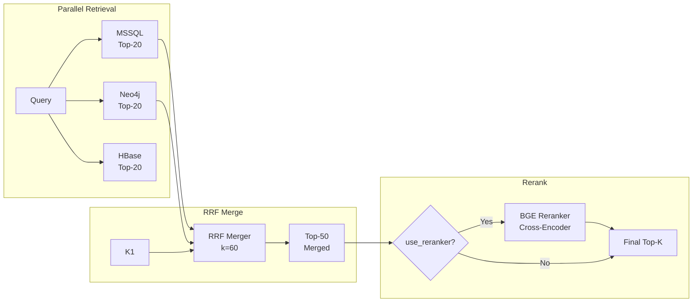

# **Semantic Search Engine — Project Plan**

## **System Architecture**



## **Data Flow**



## **Component Breakdown**

| Component              | Responsibility                              | Tech Stack                     |
| ---------------------- | ------------------------------------------- | ------------------------------ |
| **API Gateway**        | HTTP endpoints, auth, rate limiting         | FastAPI + Uvicorn              |
| **Query Router**       | Parse query, route to backends, parallelize | Python asyncio                 |
| **Embedding Service**  | Generate text embeddings                    | BGE-M3 / sentence-transformers |
| **MSSQL Vector Store** | Store vectors, similarity search            | MSSQL (native vectors, 2025+)  |
| **Neo4j Graph Store**  | Graph traversal + vector search             | Neo4j + Cypher                 |
| **HBase API**          | Analytics data search                       | REST API / HappyBase            |
| **RRF Merger**         | Merge ranked results                        | Python                         |
| **BGE Reranker**       | Cross-encoder reranking                     | BGE-reranker-base              |

## **Tech Stack**

| Category                 | Technology              | Version  |
| ------------------------ | ----------------------- | -------- |
| **API Framework**        | FastAPI                 | >= 0.115 |
| **Server**               | Uvicorn                 | >= 0.32  |
| **Database ORM**         | SQLAlchemy              | >= 2.0   |
| **Migrations**           | Alembic                 | >= 1.14  |
| **MSSQL Driver**         | pyodbc                  | >= 5.3   |
| **MSSQL Native Vectors** | SQL Server 2025+        | -        |
| **Neo4j Driver**         | neo4j                   | >= 6.1   |
| **Embeddings**           | sentence-transformers   | latest   |
| **Reranker**             | FlagEmbedding           | latest   |
| **Testing**              | pytest, httpx           | latest   |
| **Container**            | Docker + docker-compose | latest   |

---

## **API Design**

### Endpoints

| Method | Endpoint   | Description                     |
| ------ | ---------- | ------------------------------- |
| `POST` | `/search`  | Unified semantic search (MSSQL) |
| `GET`  | `/sources` | List available sources          |
| `POST` | `/ingest`  | Ingest document                 |
| `GET`  | `/health`  | Health check                    |
| `GET`  | `/docs`    | Swagger UI                      |

### Future Endpoints

| Method | Endpoint        | Description       |
| ------ | --------------- | ----------------- |
| `POST` | `/search/neo4j` | Neo4j-only search |
| `POST` | `/search/hbase` | HBase-only search |

### Request/Response Schemas

```python
# Request
class SearchRequest(BaseModel):
    query: str                           # Natural language query
    top_k: int = Field(default=10, ge=1, le=100)
    use_reranker: bool = True
    filters: dict | None = None          # Optional metadata filters
    min_score: float | None = None       # Minimum similarity threshold

# Response
class SearchResult(BaseModel):
    id: str
    content: str
    source: Literal["mssql"]
    score: float
    metadata: dict
    rerank_score: float | None = None

class SearchResponse(BaseModel):
    query: str
    results: list[SearchResult]
    total: int
    latency_ms: float
    sources_queried: list[str]
```

### Example Request/Response

```json
// POST /search
{
  "query": "machine learning algorithms for classification",
  "top_k": 10,
  "use_reranker": true,
  "filters": {
    "category": "research_papers"
  }
}
```

```json
{
  "query": "machine learning algorithms for classification",
  "results": [
    {
      "id": "doc_123",
      "content": "Support Vector Machines are supervised learning models...",
      "source": "mssql",
      "score": 0.92,
      "metadata": { "title": "SVM Overview", "category": "research_papers" },
      "rerank_score": 0.98
    }
  ],
  "total": 10,
  "latency_ms": 145,
  "sources_queried": ["mssql"]
}
```

---

## **Ranking Pipeline**

### Reciprocal Rank Fusion (RRF) Formula

```python
def rrf_fusion(results_list: list[list[SearchResult]], k: int = 60) -> list[SearchResult]:
    """
    Reciprocal Rank Fusion formula:
    RRF(d) = Σ 1/(k + rank(d))

    Where:
    - d = document
    - k = constant (typically 60)
    - rank(d) = position of document in source ranking
    """
    doc_scores: dict[str, float] = defaultdict(float)

    for results in results_list:
        for rank, doc in enumerate(results, start=1):
            doc_scores[doc.id] += 1 / (k + rank)

    # Sort by fused score descending
    fused = sorted(doc_scores.items(), key=lambda x: x[1], reverse=True)
    return fused
```

### Ranking Pipeline Flow



---

## **Folder Structure**

```text
SemanticSearchEngine/
├── app/
│   ├── __init__.py
│   ├── main.py                    # FastAPI app entry point
│   ├── config.py                  # Pydantic settings
│   ├── dependencies.py            # FastAPI dependencies
│   │
│   ├── api/
│   │   ├── __init__.py
│   │   ├── router.py          # Main API router
│   │   ├── schemas.py         # Request/Response models
│   │   └── endpoints/
│   │       ├── __init__.py
│   │       ├── search.py      # /search endpoints
│   │       ├── ingest.py      # /ingest endpoint
│   │       └── health.py      # /health endpoint
│   │
│   ├── services/
│   │   ├── __init__.py
│   │   ├── embedding.py          # Embedding generation
│   │   ├── reranker.py           # BGE reranker service
│   │   └── search/
│   │       ├── __init__.py
│   │       ├── router.py          # Query routing
│   │       ├── merger.py          # RRF implementation
│   │       ├── mssql_search.py    # MSSQL vector search
│   │       ├── neo4j_search.py    # Neo4j vector search
│   │       └── hbase_search.py    # HBase API search
│   │
│   ├── repositories/
│   │   ├── __init__.py
│   │   ├── base.py               # Base repository
│   │   ├── mssql.py              # MSSQL data access
│   │   └── neo4j.py              # Neo4j data access
│   │
│   ├── models/
│   │   ├── __init__.py
│   │   └── database.py           # SQLAlchemy models
│   │
│   └── db/
│       ├── __init__.py
│       ├── session.py            # Database sessions
│       ├── mssql.py              # MSSQL connection
│       └── neo4j.py              # Neo4j driver
│
├── alembic/
│   ├── env.py
│   ├── script.py.mako
│   └── versions/
│       └── 001_initial.py
│
├── tests/
│   ├── __init__.py
│   ├── conftest.py
│   ├── test_search.py
│   ├── test_rrf.py
│   └── test_reranker.py
│
├── scripts/
│   ├── create_indexes.sql        # MSSQL vector indexes
│   └── seed_data.py              # Test data seeding
│
├── config.py                      # Root-level config
├── pyproject.toml
├── Dockerfile
├── docker-compose.yml
├── docker.env
└── Makefile
```

---

## **Implementation Phases**

### Phase 1: Foundation & MSSQL (Current Focus)

- [x] Set up FastAPI project structure with Alembic
- [ ] Configure MSSQL connections with native vector support
- [ ] Create base SQLAlchemy models and migrations
- [ ] Implement MSSQL vector search with native VECTOR type
- [ ] Implement health check endpoint
- [ ] Set up Docker + Makefile

### Phase 2: Neo4j Integration (Future)

- [ ] Design Neo4j node/relationship schema
- [ ] Create vector indexes in Neo4j
- [ ] Implement hybrid Cypher + vector search
- [ ] Add Neo4j-specific search endpoint

### Phase 3: HBase API Integration (Future)

- [ ] Design HBase API client
- [ ] Implement data access patterns
- [ ] Create semantic search over analytics data

### Phase 4: Unified Search + RRF (Future)

- [ ] Implement query router (parallel execution)
- [ ] Implement RRF merger
- [ ] Create unified `/search` endpoint

### Phase 5: Reranking Integration (Future)

- [ ] Integrate BGE reranker
- [ ] Add reranking toggle to API
- [ ] Implement A/B testing infrastructure

### Phase 6: Evaluation & Demo (Future)

- [ ] Set up DeepEval metrics
- [ ] Retrieval accuracy evaluation
- [ ] Latency benchmarks
- [ ] Load testing with k6

---

## **MSSQL Schema Design (SQL Server 2025+ Native Vectors)**

```sql
-- Documents table
CREATE TABLE documents (
    id VARCHAR(36) PRIMARY KEY DEFAULT NEWID(),
    content TEXT NOT NULL,
    title VARCHAR(500),
    metadata JSON,
    created_at DATETIME2 DEFAULT GETUTCDATE(),
    updated_at DATETIME2 DEFAULT GETUTCDATE()
);

-- Embeddings table with native vector support
CREATE TABLE embeddings (
    id VARCHAR(36) PRIMARY KEY DEFAULT NEWID(),
    document_id VARCHAR(36) REFERENCES documents(id) ON DELETE CASCADE,
    embedding VECTOR(1536),  -- BGE-M3: 1536 dimensions
    model_name VARCHAR(100) DEFAULT 'BGE-M3',
    created_at DATETIME2 DEFAULT GETUTCDATE()
);

-- Create HNSW vector index for fast similarity search
CREATE INDEX idx_embeddings_vector_hnsw
ON embeddings USING HNSW (embedding VECTOR_COSINE_DISTANCE)
WITH (m = 16, ef_construction = 200);

-- Search history for analytics
CREATE TABLE search_history (
    id BIGINT IDENTITY PRIMARY KEY,
    query VARCHAR(1000) NOT NULL,
    sources_queried VARCHAR(100),
    results_count INT,
    latency_ms INT,
    user_id VARCHAR(100),
    created_at DATETIME2 DEFAULT GETUTCDATE()
);
```

### Similarity Search Query

```sql
-- Vector similarity search with cosine distance
SELECT TOP (@top_k)
    d.id,
    d.content,
    d.title,
    d.metadata,
    1 - (e.embedding <=> @query_vector) AS similarity_score
FROM documents d
INNER JOIN embeddings e ON d.id = e.document_id
WHERE e.embedding <=> @query_vector < @threshold  -- Cosine distance threshold
ORDER BY e.embedding <=> @query_vector;
```

---

## **Open Questions**

1. **Embedding Model**: BGE-M3 (multilingual, 1536 dim) or a different model?
2. **Data to Index**: Do you have existing documents to ingest, or should I create synthetic test data?
3. **Authentication**: Do you need API authentication (JWT, API keys) or is it internal-only?
