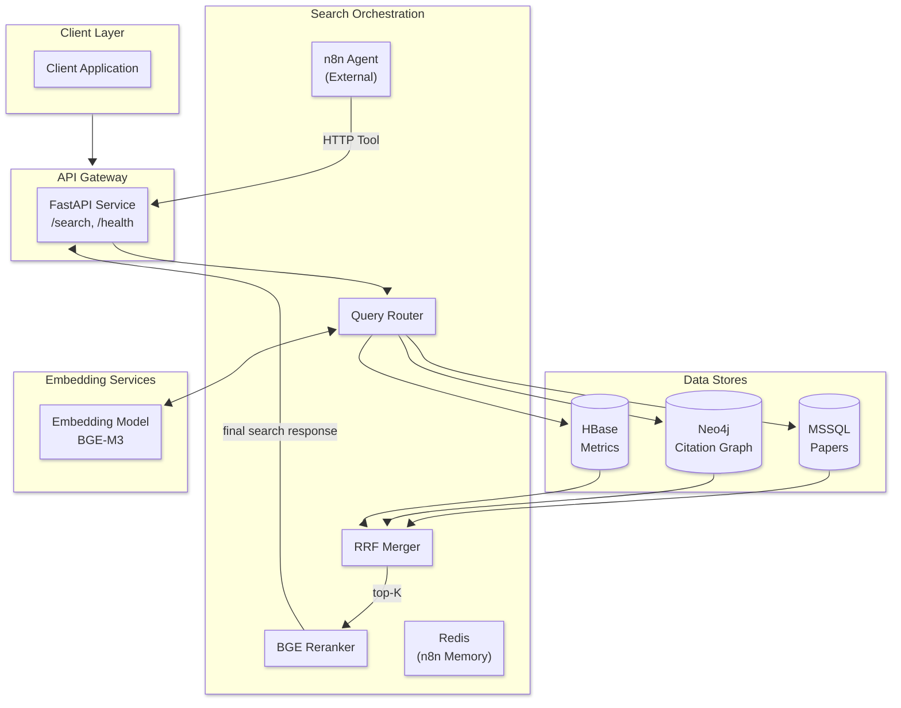
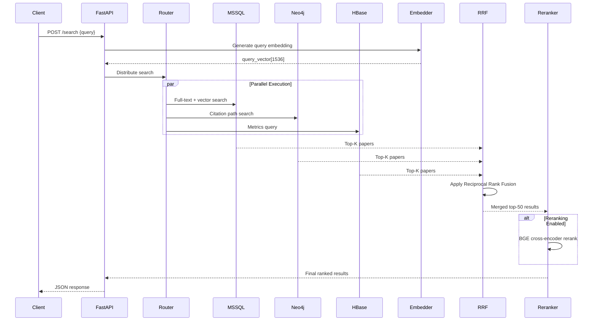
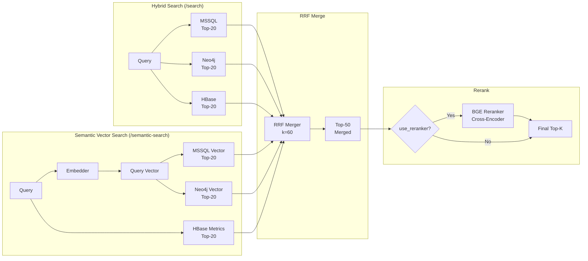

# **Semantic Search Engine — Project Plan**

## **Dataset: DBLP Academic Citation Network**

This project uses the DBLP (Digital Bibliography & Library Project) citation network dataset containing ~619K academic papers with:

- Paper metadata (title, abstract, year, venue)
- Author information (name, affiliation)
- Citation relationships
- Co-authorship networks

## **System Architecture**



## **Data Flow**



## **Database Distribution**

| Database  | Content                  | Use Case                         |
| --------- | ------------------------ | -------------------------------- |
| **MSSQL** | Papers, Authors, Venues  | Full-text search, filtering      |
| **Neo4j** | Citations, Co-authorship | Graph traversal, recommendations |
| **HBase** | Citation counts, h-index | Metrics, aggregations            |

## **Component Breakdown**

| Component             | Responsibility                              | Tech Stack                     |
| --------------------- | ------------------------------------------- | ------------------------------ |
| **API Gateway**       | HTTP endpoints, auth, rate limiting         | FastAPI + Uvicorn              |
| **Query Router**      | Parse query, route to backends, parallelize | Python asyncio                 |
| **Embedding Service** | Generate text embeddings                    | BGE-M3 / sentence-transformers |
| **MSSQL Paper Store** | Store papers, authors, venues               | MSSQL                          |
| **Neo4j Graph Store** | Citation network, co-authorship             | Neo4j + Cypher                 |
| **HBase Metrics**     | Analytics, citation counts                  | HBase / HappyBase              |
| **RRF Merger**        | Merge ranked results                        | Python                         |
| **BGE Reranker**      | Cross-encoder reranking                     | BGE-reranker-base              |
| **n8n Agent**         | External AI agent with RAG + memory           | n8n (external service)         |
| **Chat Memory**       | Persistent conversation history             | Redis (via n8n nodes)          |

## **Tech Stack**

| Category          | Technology              | Version  |
| ----------------- | ----------------------- | -------- |
| **API Framework** | FastAPI                 | >= 0.115 |
| **Server**        | Uvicorn                 | >= 0.32  |
| **Database ORM**  | SQLAlchemy              | >= 2.0   |
| **MSSQL Driver**  | pyodbc                  | >= 5.3   |
| **Neo4j Driver**  | neo4j                   | >= 6.1   |
| **Embeddings**    | sentence-transformers   | latest   |
| **Reranker**      | FlagEmbedding           | latest   |
| **Testing**       | pytest, httpx           | latest   |
| **Container**     | Docker + docker-compose | latest   |
| **AI Agent**       | n8n workflow automation | latest   |
| **Chat Memory**    | Redis Chat Memory (n8n) | latest   |

---

## **API Design**

### Endpoints

| Method | Endpoint           | Description                                |
| ------ | ------------------ | ----------------------------------------- |
| `POST` | `/search`          | **Hybrid search** (RRF: MSSQL + Neo4j + HBase) |
| `POST` | `/semantic-search` | **Semantic vector search** (MSSQL + Neo4j + HBase + RRF) |
| `POST` | `/mssql/search`     | MSSQL-only keyword search                  |
| `POST` | `/neo4j/search`    | Neo4j graph search                      |
| `POST` | `/hbase/search`     | HBase metrics endpoints                  |
| `GET`  | `/sources`         | List available sources                  |
| `GET`  | `/health`         | Health check                         |
| `GET`  | `/docs`           | Swagger UI                            |

### Request/Response Schemas

```python
# Request
class SearchRequest(BaseModel):
    query: str                           # Natural language query
    top_k: int = Field(default=10, ge=1, le=100)
    use_reranker: bool = True
    filters: dict | None = None          # Optional filters (year, venue)
    min_score: float | None = None     # Minimum similarity threshold

# Response
class PaperResult(BaseModel):
    id: str
    title: str
    abstract: str | None
    authors: list[str]
    year: int | None
    venue: str | None
    keywords: list[str]
    source: str
    score: float
    metadata: dict

class SearchResponse(BaseModel):
    query: str
    results: list[PaperResult]
    total: int
    latency_ms: float
    sources_queried: list[str]
```

### Example Request/Response

```json
// POST /search
{
  "query": "deep learning for healthcare",
  "top_k": 10,
  "filters": {
    "min_year": 2020,
    "venue": "NeurIPS"
  }
}
```

```json
{
  "query": "deep learning for healthcare",
  "results": [
    {
      "id": "53e99784b7602d9701f3ffdd",
      "title": "Deep Learning for Medical Image Analysis",
      "abstract": "We propose a novel...",
      "authors": ["John Doe", "Jane Smith"],
      "year": 2021,
      "venue": "NeurIPS",
      "keywords": ["deep learning", "medical imaging"],
      "source": "mssql",
      "score": 0.95,
      "metadata": {
        "year": 2021,
        "venue": "NeurIPS",
        "authors": ["John Doe", "Jane Smith"]
      }
    }
  ],
  "total": 10,
  "latency_ms": 145,
  "sources_queried": ["mssql"]
}
```

---

## **Ranking Pipeline**

### Hybrid Search Endpoints

| Endpoint | Method | Description |
|----------|--------|-------------|
| `/search` | POST | **Hybrid search**: MSSQL + Neo4j + HBase → RRF fusion |
| `/semantic-search` | POST | **Semantic vector search**: MSSQL + Neo4j + HBase → RRF fusion |
| `/mssql/search` | POST | MSSQL-only keyword/full-text search |
| `/neo4j/search` | POST | Neo4j graph search (citations, related, coauthors) |
| `/hbase/search` | POST | HBase metrics (keyword, author, venue, paper stats) |

### Reciprocal Rank Fusion (RRF) Formula

```python
def rrf_fusion(results_list: list[list[PaperResult]], k: int = 60) -> list[dict]:
    from collections import defaultdict
    
    doc_scores: dict[str, float] = defaultdict(float)
    doc_data: dict[str, dict] = {}

    for source_results in results_list:
        for rank, paper in enumerate(source_results, start=1):
            paper_id = paper["id"]
            doc_scores[paper_id] += 1 / (k + rank)
            if paper_id not in doc_data:
                doc_data[paper_id] = paper

    fused = sorted(doc_scores.items(), key=lambda x: x[1], reverse=True)
    results = []
    for paper_id, score in fused:
        result = doc_data[paper_id].copy()
        result["score"] = score
        result["sources"] = [paper.get("source") for paper in doc_data.values() 
                           if paper["id"] == paper_id]
        results.append(result)
    
    return results
```

**Graceful Degradation**: If any backend fails (connection error, timeout), log the error and exclude that source from fusion. Return partial results from available sources.

### Ranking Pipeline Flow



---

## **Folder Structure**

```text
SemanticSearchEngine/
├── app/
│   ├── __init__.py
│   ├── main.py                    # FastAPI app entry point
│   ├── config.py                # Pydantic settings
│   ├── dependencies.py         # FastAPI dependencies
│   │
│   ├── api/
│   │   ├── __init__.py
│   │   ├── router.py              # Main API router
│   │   ├── dto/
│   │   │   ├── __init__.py
│   │   │   └── search_dto.py     # Request/Response DTOs
│   │   └── endpoints/
│   │       ├── __init__.py
│   │       ├── search.py          # /search (hybrid RRF)
│   │       ├── mssql.py         # /mssql/search
│   │       ├── hbase.py         # /hbase/search
│   │       ├── neo4j_search.py # /neo4j/search
│   │       └── health.py        # /health endpoint
│   │
│   ├── services/
│   │   ├── __init__.py
│   │   └── search/
│   │       ├── __init__.py
│   │       ├── hybrid_search.py   # Hybrid RRF search orchestrator
│   │       ├── rrf_fusion.py   # RRF implementation
│   │       ├── mssql_search.py # MSSQL paper search
│   │       ├── neo4j_search.py # Neo4j citation search
│   │       └── hbase_search.py # HBase metrics search
│   │
│   ├── repositories/
│   │   ├── __init__.py
│   │   └── paper.py           # MSSQL paper repository
│   │
│   ├── models/
│   │   ├── __init__.py
│   │   └── database.py        # SQLAlchemy models (Paper, Author, Venue)
│   │
│   └── db/
│       ├── __init__.py
│       ├── mssql.py          # MSSQL connection
│       ├── neo4j.py         # Neo4j connection
│       └── hbase_           # HBase connection
│
├── data/
│   ├── README.md
│   └── dblp_demo.json             # DBLP dataset (~619K papers)
│
├── scripts/
│   └── init_db.py                 # Database initialization script
│
├── tests/
├── alembic/
├── pyproject.toml
├── Dockerfile
├── docker-compose.yml
├── README.md
└── Plan.md
```

---

## **Implementation Phases**

### Phase 1: Foundation & MSSQL

- [x] Set up FastAPI project structure
- [x] Configure MSSQL connections
- [x] Create SQLAlchemy models (Paper, Author, Venue)
- [x] Implement MSSQL paper search
- [x] Load DBLP dataset via init script
- [x] Set up health check endpoint
- [x] Set up Docker + Makefile
- [x] Embedding generation script

### Phase 2: Neo4j Integration

- [x] Neo4j initializer for citation graph
- [x] Build citation relationships (CITES)
- [x] Build co-authorship relationships (COLLABORATES)
- [x] Implement Neo4j citation search
- [x] Add Neo4j-specific search endpoint
- [x] Embedding generation script

### Phase 3: HBase API Integration

- [x] HBase initializer (placeholder)
- [x] Connect via API (HappyBase client, connection management, health check)
- [x] Analytical queries (implement search methods for all 6 tables)
- [x] Semantic search integration (wire HBase into RRF pipeline, `/hbase/search` endpoint)

---

### Phase 4: Unified Search + RRF

- [x] Implement RRF merger (`app/services/search/rrf_fusion.py`)
- [x] Create endpoint routing:
  - [x] `/mssql/search` - MSSQL-only keyword search
  - [x] `/hbase/search` - HBase metrics endpoints
  - [x] `/neo4j/search` - Neo4j graph search (existing)
  - [x] `/search` - **Hybrid search** (MSSQL + Neo4j + HBase + RRF)
- [x] Parallel execution across all backends (using Factory Pattern for thread-safe connections)
- [x] Graceful degradation (if one source fails, exclude from fusion)
- [x] Fix RRF min_score filter bug (RRF scores are normalized, not raw similarity scores)

#### Phase 4.2: Semantic Vector Search

- [x] Add `/semantic-search` endpoint using vector similarity search
- [x] Integrate MSSQL vector search (cosine similarity via numpy)
- [x] Integrate Neo4j vector search (native vector index)
- [x] Integrate HBase metrics into semantic search via RRF fusion
- [x] Run MSSQL vector, Neo4j vector, and HBase searches in parallel
- [x] Fix MSSQL embedding storage (JSON strings, not VECTOR type)
- [x] Generate embeddings for all 10,000 MSSQL papers
- [x] Generate embeddings for Neo4j papers and authors

---

### Phase 5: Reranking Integration

- [x] Integrate BGE reranker (`app/services/reranker.py`)
- [x] Add reranking toggle (`use_reranker` flag)
- [x] Wire reranker into hybrid search pipeline

### Phase 6: n8n Agent Integration

- [x] Install tools
    - [x] n8n
    - [x] Ollama with llama3.2:latest
    - [x] Redis
- [x] Create an agent workflow with `/search` as its tool
- [x] Integrate Ollama for LLM
- [x] Integrate Redis for memory
- [x] Fine-tune system prompt for the agent
- [x] Publish the workflow

### Phase 7: Evaluation & Demo

- [ ] Retrieval accuracy evaluation using DeepEval for `/semantic-search` endpoint
- [ ] Reranker A/B testing with/without
- [ ] Latency benchmarks

---

## **MSSQL Schema Design (Academic Papers)**

```sql
-- Venues table
CREATE TABLE venues (
    id VARCHAR(36) PRIMARY KEY,
    name VARCHAR(500) NOT NULL,
    type VARCHAR(50)
);

-- Authors table
CREATE TABLE authors (
    id VARCHAR(36) PRIMARY KEY,
    name VARCHAR(500) NOT NULL,
    affiliation VARCHAR(500),
    orcid VARCHAR(50)
);

-- Papers table
CREATE TABLE papers (
    id VARCHAR(36) PRIMARY KEY,
    title TEXT NOT NULL,
    abstract TEXT,
    year INT,
    venue_id VARCHAR(36) REFERENCES venues(id),
    keywords JSON,
    doi VARCHAR(200),
    created_at DATETIME2 DEFAULT GETUTCDATE(),
    updated_at DATETIME2 DEFAULT GETUTCDATE()
);

-- Paper-Author relationship
CREATE TABLE paper_authors (
    id VARCHAR(36) PRIMARY KEY,
    paper_id VARCHAR(36) REFERENCES papers(id),
    author_id VARCHAR(36) REFERENCES authors(id),
    author_order INT
);

-- Paper references (citations)
CREATE TABLE paper_references (
    id VARCHAR(36) PRIMARY KEY,
    paper_id VARCHAR(36) REFERENCES papers(id),
    referenced_paper_id VARCHAR(36) REFERENCES papers(id),
    reference_external_id VARCHAR(100)
);

-- Embeddings table with native vector support
CREATE TABLE embeddings (
    id VARCHAR(36) PRIMARY KEY,
    paper_id VARCHAR(36) REFERENCES papers(id),
    embedding VECTOR(1536),
    model_name VARCHAR(100) DEFAULT 'BGE-M3',
    created_at DATETIME2 DEFAULT GETUTCDATE()
);

-- Search history for analytics
CREATE TABLE search_history (
    id VARCHAR(36) PRIMARY KEY,
    query TEXT NOT NULL,
    sources_queried VARCHAR(100),
    results_count INT,
    latency_ms INT,
    created_at DATETIME2 DEFAULT GETUTCDATE()
);
```

### Search Query

```sql
SELECT TOP (@top_k)
    p.id, p.title, p.abstract, p.year,
    v.name AS venue,
    STRING_AGG(a.name, ', ') AS authors,
    1 - (e.embedding <=> @query_vector) AS similarity_score
FROM papers p
LEFT JOIN venues v ON p.venue_id = v.id
LEFT JOIN paper_authors pa ON p.id = pa.paper_id
LEFT JOIN authors a ON pa.author_id = a.id
LEFT JOIN embeddings e ON p.id = e.paper_id
WHERE p.title LIKE '%' + @query + '%'
   OR p.abstract LIKE '%' + @query + '%'
GROUP BY p.id, p.title, p.abstract, p.year, v.name, e.embedding
ORDER BY similarity_score DESC;
```

---

## **Neo4j Graph Schema**

```cypher
// Nodes
(:Paper {id, title, year})
(:Author {id, name, affiliation})
(:Venue {id, name, type})

// Relationships
(p1:Paper)-[:CITES]->(p2:Paper)
(a:Author)-[:WRITES {order: Int}]->(p:Paper)
(a1:Author)-[:COLLABORATES {count: Int}]-(a2:Author)
(p:Paper)-[:PUBLISHED_IN]->(v:Venue)
```

### Example Queries

```cypher
// Papers citing a specific paper
MATCH (p1:Paper)-[:CITES]->(p2:Paper {id: 'target_id'})
RETURN p1

// Co-authors of an author
MATCH (a1:Author)-[:COLLABORATES]->(a2:Author)
WHERE a1.name = 'John Doe'
RETURN a2

// Citation path between two papers
MATCH path = (p1:Paper)-[:CITES*1..3]->(p2:Paper)
WHERE p1.id = 'source' AND p2.id = 'target'
RETURN path
```

## Things to change

- [x] HBase should return author names not just their ID
- [ ] Unified APIs
    - [x] Get Papers
    - [ ] Get Authors
    - [ ] Get Citations
    - [ ] Get Trends
